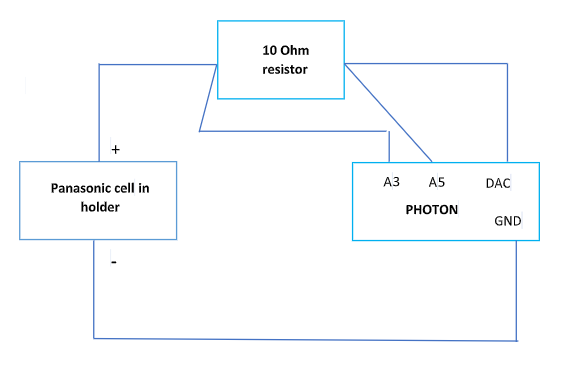

# Arias Research Group - Battery Testing Board

### Seiya Ono Sp'19

From Dr. Evans:

Idea is to carry out multi-cycle testing of a Panasonic coin cell (about 3 million cycles). With the present arrangement (a Photon mounted on a breadboard) we have reached ~ 2 million cycles and still going. The design connects the DAC output of the Photon (nominally 0 – 3.3V DC) to the positive terminal of the cell holder via a 10 Ohm resistor. The negative terminal of the cell holder is connected to GND on the Photon. Wires run from either side of the resistor to the analog input connections on the Photon so that the current can be determined from the voltage drop across the resistor (A3 to A5) and the cell voltage determined by one of the connections (A3). We have software that brings the DAC output to greater than the cell voltage during charge and lowers it to below cell voltage during discharge. A cycle takes approximately 400 ms and the data are relayed via Webhook to ThingSpeak (Math Works’ version of the cloud) for plotting/analysis.

Tasks
1. Build present design but with soldered connections. Two Photons without header pins should be here by next week. We have cell holders and cells.
1. Set up the Photons and load code (I will supply).
1. Run a couple of cells to 3 million cycles or failure, collecting data.
1. See what we can do next.

Useful Links:

[Photon](https://store.particle.io/products/photon)

## Possibilities

* External power - through maybe a barrel jack to provide external power to the entire board, so that the photon's uUSB isn't stressed
* Push buttons for Photon configuration - allows external user to set up and start different testing procedures
* Accurate ammeter for measuring current.
